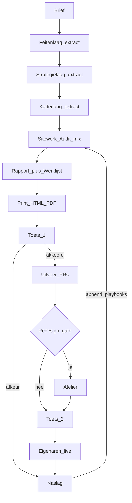

# Sitewerk — volledige specificatie (audit-ready)

**Status:** PLAN ONLY — geen implementatie tot expliciet Build-akkoord van de drie eigenaren.  
**Doel van dit document:** zo volledig dat een andere LLM (of mens) het kan auditen, tegenspreken, gaten vinden en tegenvoorstellen doen.  
**Repo-target bij latere Build:** `visionairsbv` (VisionairsBV).  
**Productnaam:** Sitewerk.  
**Taal klantoutput:** Nederlands.

---

## 0. Instructie voor auditors (andere LLM’s)

Beoordeel dit plan op:

1. **Consistentie** — tegenspraak tussen secties?  
2. **Haalbaarheid** — claims die software/processen vereisen die niet gespecificeerd zijn?  
3. **Onder-specificatie** — waar kan een bouwer 10 verschillende dingen bouwen?  
4. **Over-engineering** — wat is te zwaar voor fase 0/1?  
5. **Governance** — eigenaren-gates, stilte-regels, dual-stack risico.  
6. **Kwaliteitsrisico** — kan Naslag weer stil falen zoals bij eerdere reflect-loops?  
7. **Rapportkwaliteit** — lost template+PDF echt “AI-taal / slechte opmaak / oppervlakkige tactiek” op, of alleen de vorm?  
8. **Migratie** — is “vervang voordeur, bewaar historie” operationeel duidelijk genoeg?  
9. **Meetbaarheid** — wanneer is fase 1 “geslaagd”? Wanneer mag fase 2 starten?  
10. **Missing decisions** — open vragen die Build blokkeren?

Lever kritiek als: `BLOKKER` | `ZWAK` | `NIT` + sectienummer + voorgestelde fix.

**Expliciet buiten scope van deze audit-vraag:** het daadwerkelijk schrijven van code of playbooks in de repo.

---

## 1. Probleemstelling

### 1.1 Symptomen (eigenaarsklacht)

- Drie systemen zouden één SEO-machine moeten vormen; de **zoek/scout-laag** is bevredigend, wat **erna uitrolt** niet.
- Weinig **geavanceerde / diepe tactieken**; advies blijft hygiëne-niveau → beperkte hulp voor een bedrijf.
- **Rapportage ondermaats:** AI-taal (intern én extern), jargon, slecht leesbaar.
- **Opmaak:** blokken die niet lopen, onnodig opgebroken hoofdstukken, geen boeiend/verkoopbaar verhaal.
- Behoefte aan **samenvoegen van sterktes** tot één nieuw geheel, plus later **webdesign-vervolg**.

### 1.2 Diagnose (uit repo-onderzoek)

| Brongebied | Sterkte | Zwakte relevant voor dit plan |
| --- | --- | --- |
| Venture / business scout | KEEP-gate, evidence-first zoeken | Post-scout SEO/rapport vaak stubs, hygiëne, AI-stem |
| Technische scanner (externe repo) | Deterministische checks, platform-fixes, “onbekend ≠ slecht” | Geen strategisch verhaal; directory vs local-shop false positives |
| Diepe SEO/rapport-export (externe repo) | Evidence-discipline, decision report, NL klantvorm, 90-dagen | Hardcoded cases/schema’s; runtime niet portable; merk niet overnemen |
| VisionairsBV Forge | Eén mix → één rapport + taken; conflictregels; Camperstaan-les | Dunne mixer van PDF’s; geen eigen diepte-engine; legacy-namen/ACE |

### 1.3 Kernfout van de huidige VisionairsBV-operatie

Forge **orchestreert generators**, het **is geen SEO-product**. Kwaliteit = zwakste post-scout generator. Daardoor blijft scout goed en delivery zwak.

### 1.4 Externe ijkpunten (bureau-onderzoek, samenvatting)

Professionele audits onderzoeken doorgaans in volgorde:

1. Crawl & indexatie  
2. Rendering (waar relevant)  
3. Architectuur / interne links / templates  
4. Content (thin, cannibalization, decay, prune/rebuild)  
5. Performance (CWV, bij voorkeur per template)  
6. Structured data / entities (passend)  
7. Local/GBP (alleen als lokale zaak)  
8. Autoriteit/links (alleen met data)  
9. AI-vindbaarheid (extra laag, geen vervanging)

Rapportvorm bij sterke bureaus: executive decision + impact×effort + evidence URL’s; ruwe crawl in bijlage. Geen 60 pagina’s checklist als hoofdverhaal (Siege-achtige “high impact”-les).

**Audit-vraag:** mist dit plan een laag die voor NL MKB/directory-cases wél verplicht is? Is AI-laag te vroeg/te laat?

---

## 2. Doelen en non-doelen

### 2.1 Doelen (fase 0–1)

1. Eén productnaam en voordeur: **Sitewerk** in VisionairsBV.  
2. Klantrapport dat **beslisbaar** is (voorkeur + alternatief + wanneer heroverwegen).  
3. Rapport dat **verkoopbaar** is in PDF (typografie, cover, ritme — geen ChatGPT-exportlook).  
4. Finding-contract dat oppervlakkige “zet title tag”-advies zonder bewijs/gevolg blokkeert (procedureel; in fase 1 nog via Toets/mens, niet via parser).  
5. **Naslag** die speelboeken laat groeien uit echte afkeur/metingen.  
6. Optioneel **Atelier** (webdesign) achter redesign-gate.  
7. Locked acties onder **drie eigenaren**, niet één persoon.

### 2.2 Non-doelen (fase 0–1)

- Venture scout herschrijven.  
- Externe generator-repos forken of hun merknamen in klantoutput.  
- Dual-stack Forge/Ronin + Sitewerk actief houden.  
- SaaS-dashboard / multi-tenant crawler-platform.  
- Automatische mail/send/live.  
- Atelier standaard bij elke audit.  
- Volledige schema-validator-engine (fase 2-kandidaat).  
- Build uitvoeren vóór eigenaren-akkoord op deze specificatie.

### 2.3 Succescriteria fase 0

- Demo-PDF zonder echte diepte-inhoud: drie eigenaren zeggen **vorm OK** of geven concrete vorm-feedback.  
- Merknamen wegdenken-test: mag niet op generieke AI-PDF lijken.

### 2.4 Succescriteria fase 1

- Referentiezaak-rapport op Sitewerk-template + PDF naast oude output; eigenaren kunnen “beter / niet beter” benoemen op: diepte, taal, opmaak, verkoopbaarheid.  
- Elke Toets-afkeur heeft één zin; her-run zonder die zin is ongeldig.  
- Geen actieve playbook die nog Forge/Ronin als voordeur beschrijft.

### 2.5 Succescriteria om fase 2 te mogen starten

Niet “10 runs”. Wel:

- ≥1 les getagd `kandidaat-code` die **≥3 aparte runs** dezelfde contractbreuk toont, **of**  
- Toets noemt dezelfde blocker **≥2×**, **en**  
- Eigenaren-gate M7 zegt expliciet ja tot schema/validator.

**Audit-vraag:** zijn succescriteria falsifieerbaar genoeg? Ontbreekt een kwantitatieve diepte-score?

---

## 3. Beslissingen die al genomen zijn (in dit plan)

| ID | Beslissing | Rationale |
| --- | --- | --- |
| D1 | Productnaam Sitewerk; geen legacy-productnamen in klant/actieve playbooks | Voorkomt merkenchaos en dual identity |
| D2 | VisionairsBV is enige schrijf-voordeur | Eén waarheid voor rapport/taken |
| D3 | Hybride: PDF-theme = software nu; diepe validators later | Vorm verkopen ≠ hele engine vooraf |
| D4 | Forge/Ronin actieve paden vervangen/archiveren, historie bewaren | Geen dual-stack |
| D5 | Build ≠ Venture-swarm | Voorspelbare file-oplevering |
| D6 | Finding-contract verplicht in template | Tegengif oppervlakkigheid |
| D7 | Onderzoek in vaste volgorde (sectie 5) | Bureau-ijking |
| D8 | Atelier alleen na redesign-gate | Voorkomt scope creep |
| D9 | Stilte ≠ ja op locked acties | Drie eigenaren |
| D10 | Geen Build tot dit document geaudit/akkoord | Expliciete eigenaarswens 2026-09-13 |

### 3.1 Open beslissingen (blokkeren of kleuren Build)

| ID | Vraag | Default in dit plan tot herroepen | Impact |
| --- | --- | --- | --- |
| O1 | Locked: unaniem 3/3 of 2-van-3? | **Unaniem 3/3** | Governance |
| O2 | Welke zaak is eerste referentie-PDF? | Camperstaan (bestaande evidence in repo) | example-ref |
| O3 | PDF-engine (Playwright print / WeasyPrint / pandoc+typst / handmatig Chrome)? | **Playwright of headless Chromium print van self-contained HTML** | pdf-theme |
| O4 | Mogen Feiten/Strategie/Kader nog externe JSON/PDF inlezen of alleen handmatige `in/*.md` extracts? | Fase 1: **extracts in run-map**; geen harde runtime-koppeling | architectuur |
| O5 | Stemmen eigenaren via Slack/PR/review-file? | `runs/<id>/toets.md` + expliciete namen | operatie |

**Audit-vraag:** welke O* moet BLOKKER worden vóór fase 0?

---

## 4. Naamgeving en anti-legacy regels

### 4.1 Publieke / actieve vocabulaire

Sitewerk, Audit, Werklijst, Toets 1, Toets 2, Naslag, Atelier, Eigenaren-gate, Feitenlaag, Strategielaag, Kaderlaag, Brief.

### 4.2 Verboden in klantoutput en actieve playbooks

Webregie, Wilkoro/Wilkoro, Venture-crew persoonsnamen als autoriteit (Nils/Sara/…), Forge-als-product, Ronin/ACE-jargon naar klant, generator-merkclaims (“volgens tool X”).

### 4.3 Toegestaan intern/archief

`playbooks/_archief/`, oude `runs/…`, root-PDF’s als bronmateriaal, private technical notes met herkomst-IDs zonder merknamen in klantproza.

---

## 5. Onderzoeksmodel (Audit)

### 5.1 Verplichte volgorde

Agents/mensen mogen parallel meten, maar **rapporteren en prioriteren** in deze volgorde. Downstream-advies zonder bovenliggende laag is ongeldig (bijv. content-rewrite terwijl indexatie geblokkeerd is → eerst indexatie).

1. Crawl & indexatie  
2. Rendering (JS) — skip met reden als site statisch/SSR en steekproef schoon is  
3. Architectuur / templates / interne links  
4. Content kwaliteit & intentie  
5. Performance (kern-templates)  
6. Structured data / entities — alleen passend bij sitetype  
7. Local / GBP — **alleen** lokale dienst/winkel; **niet** nationaal directory/platform tenzij bewezen relevant  
8. Links / autoriteit — alleen met gemeten data; anders “onbekend”  
9. AI-vindbaarheid — steekproef; nooit vervanging van 1–8  

### 5.2 Sitetype-matrix (bepaalt welke lagen “n.v.t.” mogen)

| Type | Voorbeeld | Local/GBP | Directory-specifiek |
| --- | --- | --- | --- |
| Lokale dienst | kapper, garage | verplicht relevant | nee |
| Directory/platform | Camperstaan | meestal n.v.t. (les: geen LocalBusiness-theater) | hubs, cannibalization, template-schaal |
| Content/merk | blog/media | zelden | topical clusters, decay |

### 5.3 Finding-contract (elke bevinding)

Velden (verplicht):

```text
id: F-###
laag: 1-9
observatie: string
bewijs: URL | meting | extract-id
bewijs_label: gemeten | afgeleid | onbekend
gevolg_zaak: string (commercieel/operationeel, geen jargon)
actie: string (concreet)
eigenaar: wij | jullie | gedeeld
effort: S | M | L
prio: P0 | P1 | P2 | P3
meetpunt: string | "geen zonder baseline"
afhankelijk_van: F-###[] | []
```

**Afkeurregels (Toets 1):**

- Finding zonder bewijs_label of met bewijs_label=onbekend maar geformuleerd als feit → afkeur.  
- %-traffic/rank belofte zonder baseline → afkeur.  
- LocalBusiness/GBP-eis op directory zonder kader-reden → afkeur (Camperstaan-precedent).  
- Actie zonder “klaar als” in Werklijst → afkeur.  
- AI-jargonlijst (niet uitputtend): leverage, unlock, boost visibility, game-changer, synergie, “Google houdt van…” → afkeur.

### 5.4 Dieptenorm (wat “niet oppervlakkig” betekent)

Minimaal in een volwaardige Audit-run:

- ≥1 architectuur- of template-niveau insight (niet alleen page-level title).  
- ≥1 content-besluit van type prune/merge/rewrite/build-hub met reden.  
- Expliciete conflictresolutie als Feitenlaag ↔ Strategielaag botsen.  
- Top 3 acties gekoppeld aan gevolg_zaak, niet aan toolscore.  
- Bijlage B: afgewezen scanner-tips met reden.

**Audit-vraag:** is deze dieptenorm streng genoeg of nog steeds gamebaar met drie vage zinnen?

---

## 6. Rapportproduct

### 6.1 Artefacten per run

```text
runs/<id>/
  brief.md
  in/feiten.md
  in/strategie.md
  in/kader.md
  mix.md                 # conflicten + keuzes
  rapport-klant.md       # bron voor PDF
  rapport-intern.md      # evidence IDs, niet standaard naar klant
  werklijst.md
  toets.md               # Toets 1/2 + eigenaren-initialen
  feedback.md            # bij afkeur verplicht
  reflect.md             # Naslag input
  print/rapport.html
  print/rapport.pdf
```

### 6.2 Klantrapport — sectiecontract

1. **Titelblok** — klant, peildatum, status “concept / niets live”  
2. **In het kort** — 8–12 regels, geen scoretheater  
3. **Eerste besluit** — één zin  
4. **Drie hoogste acties** — actie / waarom / klaar als  
5. **Wat al goed is** — niet kapotmaken  
6. **Wat we hebben bekeken** — tabel lagen + status + expliciet niet-bekeken  
7. **Het verhaal** — 1–3 conclusiekoppen met proza + bewijs (geen “Technical Findings”)  
8. **Keuzes** — max 3; voorkeur + alternatief + heroverwegen-als  
9. **Werklijst 90 dagen** — maand 1/2/3 + buiten scope  
10. **Meten** — bekend / onbekend / 30d / 90d  
11. **Atelier-zin** — alleen als redesign-gate open mag  
12. **Bijlage A** — bewijsregels  
13. **Bijlage B** — afgewezen automatische tips  

### 6.3 PDF / visuele specificatie

**Pipeline:** `rapport-klant.md` → fill `templates/rapport-print.html` → `assets/rapport-theme.css` → headless print → `rapport.pdf`.

**Theme-eisen:**

- A4 `@page`, print-first  
- Één display-font + één body-font (geen Inter/Roboto/Arial als primary)  
- Cover: merk Sitewerk/Visionairs + klant + datum  
- Geen paarse AI-gradients, geen glow, geen stock-illustratie-ruis  
- “In het kort” + top 3 visueel zwaarder dan bijlagen  
- Page-break op natuurlijke sectiegrenzen, niet na elke H3  
- Tabellen leesbaar op papier  

**Vormtoets (eigenaren M1):** merknamen weg → mag niet generiek AI aanvoelen.

### 6.4 Taalcontract

- Nederlands, korte zinnen, actieve vorm.  
- Jargon max 1× dan uitleg tussen haakjes.  
- Koppen = conclusies.  
- Verboden frasen: sectie 5.3.  

**Audit-vraag:** moet er een machine-checkbare denylist in fase 1, of blijft dit Toets-only?

---

## 7. Systeemarchitectuur



### 7.1 Lagenverantwoordelijkheid

| Laag | Levert | Mag niet |
| --- | --- | --- |
| Feitenlaag | technische observaties, scores, headers, CMS-fix hints | strategie/final klantproza; directory dwingen tot local-shop schema |
| Strategielaag | SEO/content/90d, commercial beyond SEO, evidence-bound claims | live changes; verzonnen volumes |
| Kaderlaag | opdracht, parkregels, niet-doen, packet-grenzen | scanner-vinkjes overrulen zonder reden (wel: type-mismatch mag overrulen) |
| Audit-mix | één waarheid, conflictresolutie feit>vorm>wens | drie parallelle PDF-waarheden |

### 7.2 Conflictprotocol

1. Noteer conflict in `mix.md`.  
2. Pas regel toe: **feit > vorm > wens**.  
3. Type-mismatch (scanner wil GBP, kader zegt directory) → kader + Camperstaan-precedent.  
4. Restant → Toets-vraag aan eigenaren, geen tweede klantwaarheid.

### 7.3 Migratie dual-stack

| Pad | Actie bij Build |
| --- | --- |
| `AGENTS.md`, `docs/PIJPLIJN.md` | Herschrijven naar Sitewerk |
| `playbooks/forge.md` e.d. | Vervangen of naar `playbooks/_archief/` |
| `runs/2026-09-11-camperstaan/` | Bewaren read-only |
| `camperstaan/` app | Niet wissen |
| Root PDFs | Bron; niet actieve waarheid |

**Verboden:** `sitewerk.md` actief naast `forge.md` als twee voordeuren.

---

## 8. Naslag (leerloop)

### 8.1 Triggers

- Toets 1 of 2 afkeur  
- Post-live / 30-60-90 meting beschikbaar  
- Uitvoer brak iets of loste finding aantoonbaar op  

### 8.2 `feedback.md` schema

```text
run_id:
toets: 1|2
oordeel: afkeur|deels|akkoord
wat_mis: [verplichte zin bij afkeur]
wat_goed:
regel_kandidaat:
herhaling_count:
tag: kandidaat-code|playbook-only|geen
eigenaar_initialen: [..]
```

### 8.3 Curator-regels

- Alleen **append/amend bullets** in playbooks; geen volledige herschrijf.  
- Geen PII in lessons.  
- Geen verzonnen lessen zonder trigger-evidence.  
- Skill-bestand pas na **3 echte herhalingen + kleine test**.  
- `kandidaat-code` voedt fase-2 backlog.

### 8.4 Waarom eerdere loops faalden (ontwerpmitigatie)

Eerdere reflect bestond maar promoveerde zelden. Mitigatie: her-run **ongeldig** zonder afkeurzin; Toets-template forceert veld; M7 review op Naslag-log.

**Audit-vraag:** is “ongeldige her-run” enforceerbaar zonder software, of theater?

---

## 9. Atelier (webdesign-vervolg)

### 9.1 Startvoorwaarden (allemaal)

1. Toets 1 akkoord op Audit.  
2. Eigenaren redesign-gate ja (+ klantja wanneer extern).  
3. Site ontbreekt / coming-soon / aantoonbaar zwak (niet: sterke site vervangen door dunnere mock).  
4. Feitenvloer: naam, adres, tel, uren/diensten uit dossier — geen verzinsels.

### 9.2 Flow

`design-brief.md` (stijl + rationale via bestaande craft-routing; vault niet kopiëren) → bouwvolgorde one-pager/IA uit SEO-hubbesluiten → `werklijst-design.md` → PRs → Toets 2 op gecombineerde preview.

### 9.3 Aanbodzin in klantrapport

Alleen als 9.1.2 open mag. Anders weglaten.

---

## 10. Governance

### 10.1 Eigenaren

Drie eigenaren. Locked: live, externe mail, geld, publiceren.  
Default locked-stem: **unaniem 3/3** (O1).  
Toets-afkeur: **1** eigenaar + verplichte zin.  
Stilte ≠ ja.

### 10.2 Vaste momenten (tijdlijn)

```text
M0  Geen Build — deze specificatie auditten (nu)
M0b Eigenaren-akkoord op specificatie + stemregel O1
M1  Na Build fase0: VORMAKKOORD demo-PDF
M2  Eerste referentie-inhoudsrun
M3  INHOUDSTOETS referentie-rapport+PDF
M4–M6 Productieruns + Naslag elke Toets
M7  Naslag-review → wel/niet fase 2
M8+ Fase 2 alleen bij expliciet ja
```

Kalenderduur bewust niet in dagen beloofd (agent/eigenaren-tempo). Volgorde is hard; data’s vullen eigenaren in.

### 10.3 Wat “Build” betekent als die ooit komt

Eén agent schrijft bestanden in `visionairsbv`. Geen executive-swarm. Oplevering = templates, theme, export, playbooks, Naslag, Atelier-doc, migratie voordeur, referentie-run+PDF. Geen SaaS.

---

## 11. Hybride software-strategie (samenvatting voor auditors)

| Fase | Software | Markdown/proces |
| --- | --- | --- |
| 0 | HTML/CSS theme + PDF export | leeg/demo content |
| 1 | zelfde renderer | playbooks, findings, Naslag |
| 2 | schema/validator/denylist-automation waar pijn ≥ drempel | speelboeken blijven voor oordeel |

**Bewuste afwijzing:** “alles .md tot 10 runs” (vorm blijft dan zwak) en “alles software nu” (checklist-theater + te vroeg star).

---

## 12. Pitch voor compagnons (verkorte beslisslide)

Zie eerdere pitchdeck-sectie in conversatiehistorie; kernvraag: enige voordeur Sitewerk fase 0+1, hybride, eigenaren-gate, eerste review = vorm-PDF. **Nu: geen Build — eerst audit van dit document.**

---

## 13. Risicoregister

| Risico | Kans | Impact | Mitigatie | Rest |
| --- | --- | --- | --- | --- |
| Dual-stack Forge+Sitewerk | M | H | Archiveren actieve paden | Procesdiscipline |
| Naslag stil | H | H | Verplichte afkeurzin; M7 | Zonder handhaving theater |
| Vorm OK / inhoud nog oppervlakkig | H | H | Dieptenorm 5.4 + Toets | Toets kan soft zijn |
| Referentie = directory generaliseert slecht naar local | M | M | Sitetype-matrix 5.2 | Tweede referentie later |
| PDF-engine rommelig in CI | M | M | O3 kiezen; self-contained HTML | Tooling |
| Fase 2 nooit | M | M | M7 gate + kandidaat-code tags | Eigenarenprioriteit |
| Te vroeg validator | L | M | Verboden in fase 0/1 | — |
| Vault/craft onbereikbaar voor Atelier | M | L | BOUWVOLGORDE in-repo floor | Atelier uitstellen |

---

## 14. Testplan (voor wanneer Build wél start — nu niet uitvoeren)

1. Demo-HTML/PDF tegen vormchecklist (sectie 6.3).  
2. Template invullen met Camperstaan-extracten; verifiëren finding-contract velden.  
3. Bewust slechte findings injecteren (geen bewijs, GBP op directory, AI-frase); Toets moet afkeuren.  
4. Diff-kwaliteit: oude Forge-rapport vs nieuw (taal, diepte, opmaak) — subjectieve eigenaren-score 1–5 op 4 assen.  
5. Naslag: fake afkeur → bullet append → her-run zonder feedback.md moet als ongeldig gedocumenteerd zijn.

---

## 15. Bestandsboom (voorgenomen, nog niet aangelegd)

```text
visionairsbv/
  AGENTS.md                          # herschreven Sitewerk
  docs/PIJPLIJN.md                   # herschreven
  playbooks/
    audit.md
    toets.md
    naslag.md
    uitvoer.md
    atelier.md
    rapport-pdf.md
    _archief/                        # oude forge/gate/...
  templates/
    rapport-klant.md
    rapport-intern.md
    rapport-print.html
    werklijst.md
    feedback.md
    toets.md
    design-brief.md
  assets/
    rapport-theme.css
  lessons/
    outcomes.md
    kandidaten-code.md
  scripts/                           # optioneel print export
  runs/<new-id>/...
```

---

## 16. Traceability: klacht → ontwerp

| Klacht | Ontwerpantwoord |
| --- | --- |
| Oppervlakkige tactiek | Lagen 5.1 + dieptenorm 5.4 + bijlage B |
| AI-taal / jargon | Taalcontract 6.4 + Toets denylist |
| Slechte opmaak / niet verkoopbaar | PDF theme 6.3 + M1 vormgate |
| Geen geheel uit drie systemen | Mix 7.1–7.2 + één voordeur |
| Systeem moet leren | Naslag 8 + M7 |
| Webdesign later | Atelier 9 |
| Niet alleen Robin | Governance 10 |
| .md vs software debat | Hybride 11 |

---

## 17. Bekende zwaktes van DIT plan (self-audit)

1. Dieptenorm is deels subjectief → Toets kan soft scoren.  
2. Zonder PDF-engine-keuze (O3) is fase 0 ondergespecificeerd voor een bouwer.  
3. Handmatige extracts schalen slecht; bewust fase-1 tradeoff.  
4. “Ongeldige her-run” is sociaal protocol, geen CI-gate tot fase 2.  
5. Eén directory-referentie bias’t het systeem.  
6. Atelier hangt af van vault-bereikbaarheid die in deze VM mogelijk ontbreekt.  
7. Unanimiteit 3/3 kan deadlock veroorzaken (daarom O1 open).

Auditors: breid deze lijst uit; bestrijd self-audit niet als compleet.

---

## 18. Wijzigingslog (plan)

- 2026-09-13: probleem → Sitewerk hybride → PDF → geen dual-stack → pitchdeck → **uitgewerkt tot audit-ready specificatie; Build bevroren**.

---

## 19. Expliciete stopregel

**Geen bestanden schrijven in `visionairsbv` of andere productrepos ter implementatie van Sitewerk totdat de drie eigenaren dit document (of een herziene versie) akkoord geven en om Build vragen.**

Einde specificatie.
